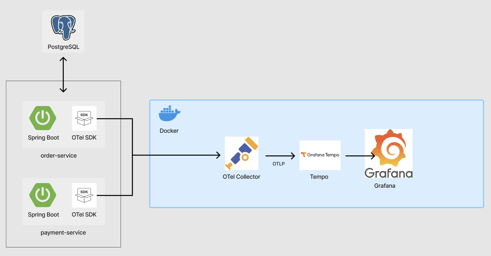

# 🌐 OpenTelemetry 기반 분산 트레이싱 데모 프로젝트


<br>

## 🧠 프로젝트 소개

이 프로젝트는 **OpenTelemetry**를 활용한 분산 추적 시스템을 직접 구성하고,  
**마이크로서비스 간 요청 흐름을 시각적으로 추적**할 수 있도록 구현한 데모입니다.  
실제 서비스 환경에서 장애 추적, 병목 탐지, 흐름 파악을 얼마나 쉽게 할 수 있는지를 시각화하여 보여주는 것이 목표입니다.

---

<br>

## 🏗️ 아키텍처 구성

- **Spring Boot 마이크로서비스 2개**
  - `order-service`: 주문 요청 처리 및 결제 호출
  - `payment-service`: 결제 응답 처리 (응답 지연 시뮬레이션 포함)
- **PostgreSQL**: 재고 및 주문 저장용 DB
- **OpenTelemetry Collector**: 데이터 수집 및 처리
- **Tempo (Grafana)**: 트레이스 저장소
- **Grafana**: 트레이스 시각화 도구

<br>




---

<br>

## 🔍 주요 기술 스택

| 기술                         | 설명                                       |
|------------------------------|--------------------------------------------|
| Spring Boot                  | 마이크로서비스 애플리케이션                |
| PostgreSQL                   | 주문/재고 데이터 저장                      |
| Docker                       | Grafana, Tempo, Collector 컨테이너 구성   |
| OpenTelemetry SDK            | 트레이스 생성 및 전파                      |
| Java Agent                   | 자동 스팬 생성                            |
| Grafana Explore              | 트레이스 시각화 도구                       |
| Tempo                        | 분산 트레이스 저장소 (Grafana 연동 최적화) |

---
<br>

## 🎯 실습 목표

1. **분산 트레이싱의 필요성 체감**
2. **OpenTelemetry의 구조 및 동작 흐름 이해**
3. **Collector - Exporter - Backend 연동 실습**
4. **실제 에러 시나리오 트레이싱 및 시각화**

---
<br>

## 🧪 테스트 시나리오

| 테스트 케이스          | 호출 예시                                              | 기대 결과                   |
|------------------------|--------------------------------------------------------|-----------------------------|
| ✅ 정상 주문           | `GET /order?productName=Book&delay=100`               | 주문 성공                   |
| ❌ 재고 없음           | `GET /order?productName=OutOfStockItem&delay=100`     | 주문 실패 (재고 없음)      |
| ❌ 결제 지연 (타임아웃) | `GET /order?productName=Book&delay=600`               | 주문 실패 (결제 지연 초과) |

> 테스트 결과는 Grafana → Explore 메뉴에서 확인 가능하며, 각 스팬에 대한 지연 시간 및 에러 상태 확인 가능

---

<br>

## 📸 트레이싱 구조

- 루트 스팬: `/order`  
- 자식 스팬들:
  - `check-stock`
  - `call-payment-api`
  - `save-order`

에러 발생 시 해당 자식 스팬에 `Status: ERROR` 와 함께 예외 메시지가 시각화됨

---

<br>

## 🔧 주요 설정 요약

### application.yml

```yaml
otel:
  exporter:
    otlp:
      endpoint: http://localhost:4317
  service:
    name: order-service
management:
  endpoints:
    web:
      exposure:
        include: "*"
```
### docker-compose.yml

```yaml
services:
  collector:
    image: otel/opentelemetry-collector-contrib:latest
    ports:
      - "4317:4317"
  tempo:
    image: grafana/tempo:latest
    ports:
      - "3200:3200"
  grafana:
    image: grafana/grafana-oss:latest
    ports:
      - "3000:3000"
  postgres:
    image: postgres:14
    environment:
      POSTGRES_DB: demo_db
      POSTGRES_USER: demo
      POSTGRES_PASSWORD: demo123
    ports:
      - "5432:5432"
```

<br>

## 🙋‍♂️ 결론
지금까지는 개발 과정에서 수많은 로그를 출력하고 그 로그 속에서 버그를 찾아내기 위해 고군분투해왔다.
이러한 방식은 단일 서비스 환경에서는 어느 정도 효과를 보았지만 마이크로서비스 환경에서는 분명한 한계가 존재한다.

OpenTelemetry는 이 한계를 극복할 수 있는 해법이었다.
서비스 간의 흐름을 시각적으로 파악할 수 있도록 구성되어 있으며 문제가 발생한 지점을 정확하게 추적(Trace)할 수 있도록 설계되었다.

이를 통해 디버깅에 소요되는 시간은 확연히 줄었고 시스템 전체에 대한 이해도 역시 눈에 띄게 향상되었다.

트레이싱이 얼마나 중요한지, OpenTelemtry가 이에 얼마나 강력하게 사용이 될 수 있는지 알게되어 매우 유익한 프로젝트였다.
